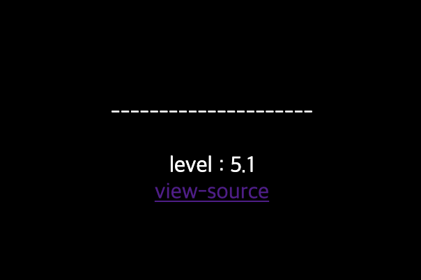

# 16

## 초기화면


level의 초기값은 1로 되어있다. 

---
## 풀이
소스코드를 보면 php코드를 확인할 수 있다.
```php
<?php
  if(!is_numeric($_COOKIE['user_lv'])) $_COOKIE['user_lv']=1;
  if($_COOKIE['user_lv']>=6) $_COOKIE['user_lv']=1;
  if($_COOKIE['user_lv']>5) solve(1);
  echo "<br>level : {$_COOKIE['user_lv']}";
?>
```
쿠키값에 따라 결과를 출력한다. user_lv가 5보다 크면 solve(1) 함수를 호출하지만 6보다 크거나 같으면 user_lv=1로 설정한다.

EditThisCookie라는 툴을 통해서 쿠키값을 변경한다. 5보다 크게 그러나 6보다 작게 5.1로 변경을 해보면 통과한다.

---
## 통과


