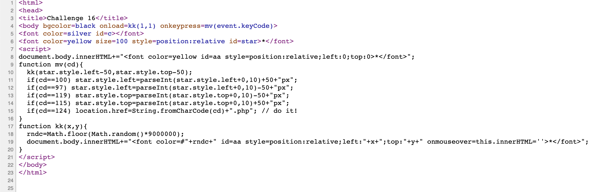
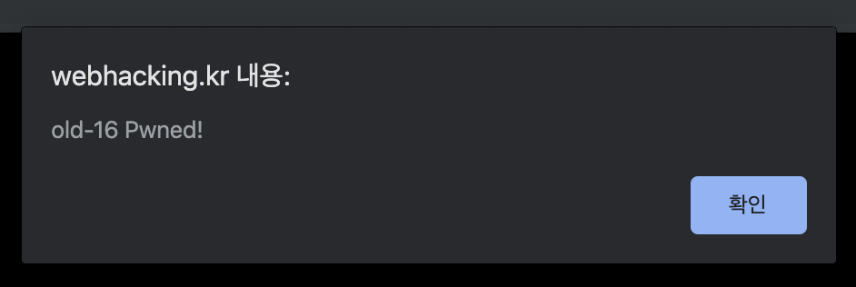
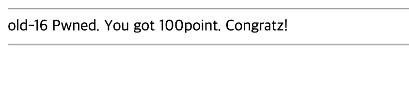

# 16

## 초기화면


---
## 풀이


소스코드를 확인해 본다
```javascript
document.body.innerHTML+="<font color=yellow id=aa style=position:relative;left:0;top:0>*</font>";
function mv(cd){
  kk(star.style.left-50,star.style.top-50);
  if(cd==100) star.style.left=parseInt(star.style.left+0,10)+50+"px";
  if(cd==97) star.style.left=parseInt(star.style.left+0,10)-50+"px";
  if(cd==119) star.style.top=parseInt(star.style.top+0,10)-50+"px";
  if(cd==115) star.style.top=parseInt(star.style.top+0,10)+50+"px";
  if(cd==124) location.href=String.fromCharCode(cd)+".php"; // do it!
}
function kk(x,y){
  rndc=Math.floor(Math.random()*9000000);
  document.body.innerHTML+="<font color=#"+rndc+" id=aa style=position:relative;left:"+x+";top:"+y+" onmouseover=this.innerHTML=''>*</font>";
}
```

font 태그를 이동시킬 수 있는 스크립트 코드이다. a,s,d,w 를 통해 이동시킨다


if문의 마지막을 보면 124는 아스키코드로 | 이다. 입력을 해보면 페이지 이동을 한다.

---
## 통과



