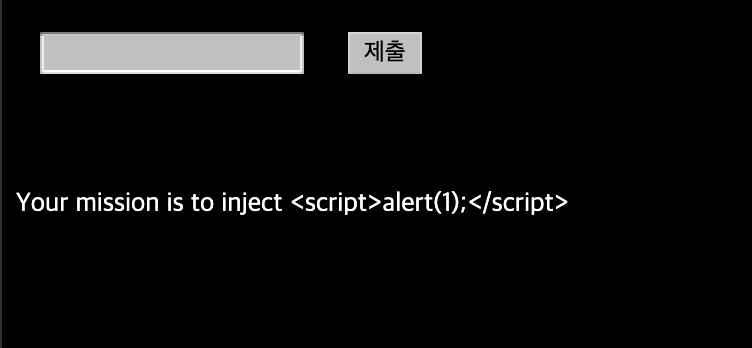
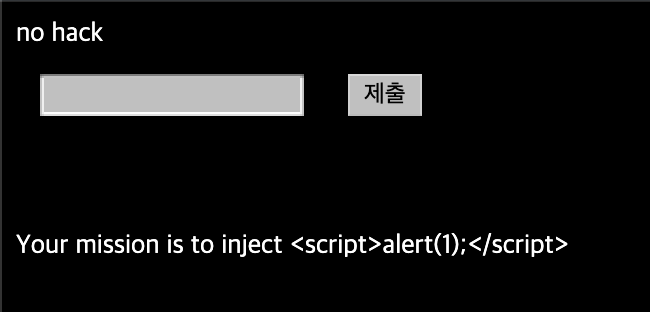
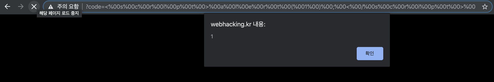
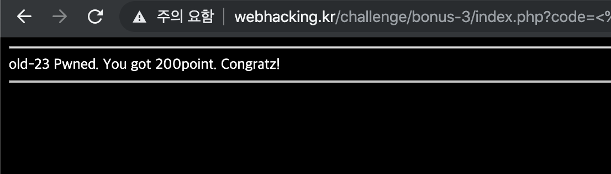

# 23

## 초기화면

script를 입력해야 하는 문제이다.

---
## 풀이
입력창에 그냥 다짜고짜 ``를 입력해보면 

이런 창이 뜬다. 이제 여러가지를 입력해보면서 뭐가 필터링되는지를 확인해본다.

입력해 본 결과 숫자는 입력이 잘된다. 

그 이외의 문자는 한글자만 입력되고 그 이상으로 입력하면 no hack이 뜬다.

HTML url 인코딩문자들을 입력해보면 잘 입력이 된다

문장 종결문자인 널문자(%00)을 입력하고 스크립트를 입력해도 진행이 안되서 한글자 마다 널문자를 삽입해서 진행을 해보면

---
## 통과

