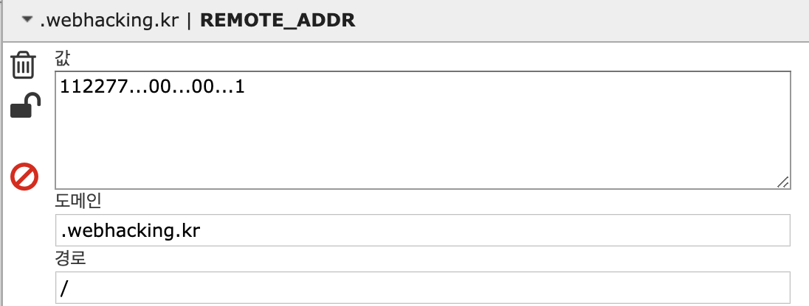

# 24

## 초기화면


---
## 풀이

```php
  extract($_SERVER);
  extract($_COOKIE);
  $ip = $REMOTE_ADDR;
  $agent = $HTTP_USER_AGENT;
  if($REMOTE_ADDR){
    $ip = htmlspecialchars($REMOTE_ADDR);
    $ip = str_replace("..",".",$ip);
    $ip = str_replace("12","",$ip);
    $ip = str_replace("7.","",$ip);
    $ip = str_replace("0.","",$ip);
  }
  if($HTTP_USER_AGENT){
    $agent=htmlspecialchars($HTTP_USER_AGENT);
  }
  echo "<table border=1><tr><td>client ip</td><td>{$ip}</td></tr><tr><td>agent</td><td>{$agent}</td></tr></table>";
  if($ip=="127.0.0.1"){
    solve(24);
    exit();
  }
  else{
    echo "<hr><center>Wrong IP!</center>";
  }
```
소스코드를 확인해 본다

$_SERVER, $_COOKIE에서 ip랑 agent값을 추출하는 것을 알 수 있다. 마지막 if문에서 결국 추출한 ip값이 127.0.0.1 이어야 pass할 수 있음을 알 수 있다.

처음 if문에서 REMOTE_ADDR에서 추출한 ip의 값을 다 바꿔버린다. 이를 우회해야 한다.

`112277...00...00...1`로 우회하면 된다.

차근차근 보면

처음 replace에서 `112277..00..00..1` <br>
다음 `1277..00..00..1` <br>
다음 `127.00..00..1` <br>
다음 `127.0.0.1`


쿠키 변조 프로그램을 통해 REMOTE_ADDR을 생성하고 값을 넣는다


---
## 통과


