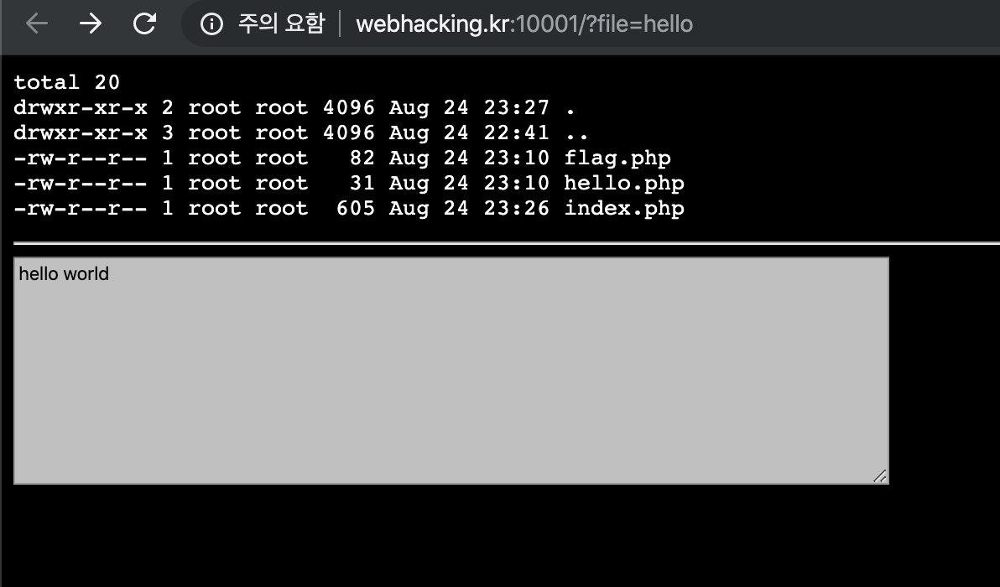
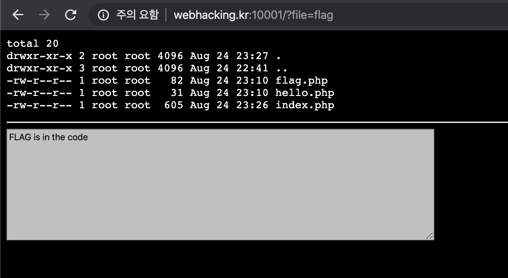
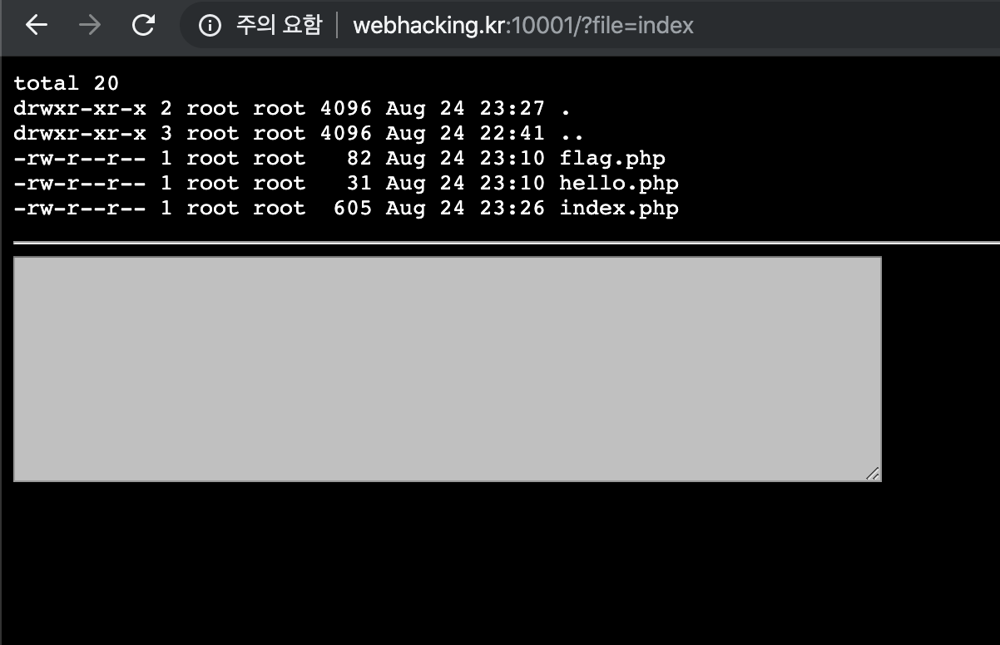
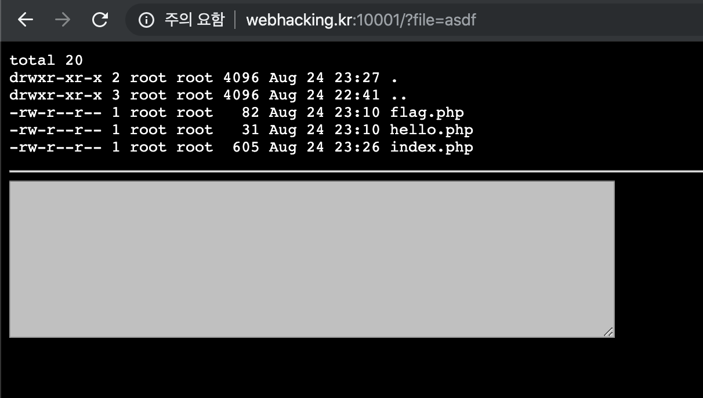
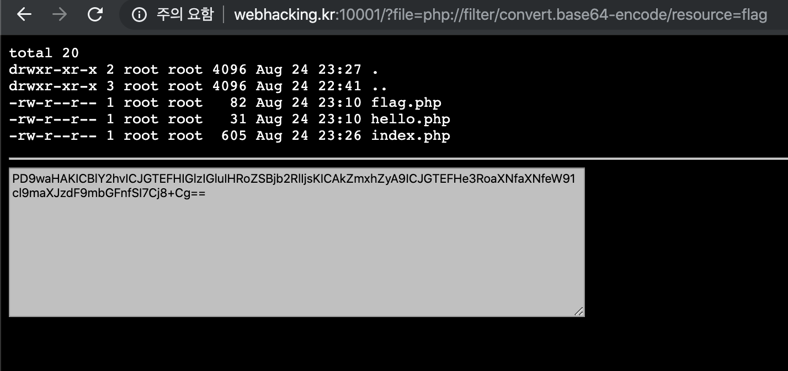
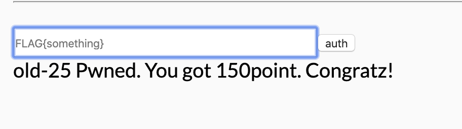

# 25

## 초기분석


리눅스 콘솔창의 모습을 구현해놓았다.
아마 서버의 모습을 표현한듯..3개의 파일이 있고 url 끝에 `file=hello` 가 눈에 들어온다. 값을 바꿔가며 확인 해 본다.



`hello`와 `flag`를 제외하면 어떤 값을 입력해도 아무것도 안 뜬다. 그렇다면 말 그대로 flag.php 코드 안에 FLAG가 적혀있겠다고 본다.

---
## 풀이

여기에서는 LFI이라는 기법을 활용해야 한다.

> # LFI(Local File Inclusion)
>로컬 파일 인클루전은 웹 브라우저를 통해 서버 내 (로컬) 파일에 접근하는 공격 방식이다. 예를 들면, 유저가 요청한 파일을 PHP의 include를 이용해 사용할 때, 요청된 파일 주소를 적절히 처리하지 않았을 때 생긴다. 이 취약점을 이용해 서버 내 파일의 내용이 노출될 수 있다.
>[출처](https://chobodevnote.blogspot.com/2016/09/file-inclusion-vulnerability_23.html)
>
>PHP에서는 `php://filter`를 사용해서 File IO하는 방법이 있는데, 이게 문자열로 넘어가기 때문에 필터링 우회에 사용할 수 있다.
> 예를 들어 `flag.txt`라는 문자열로 필터링해놓은 경우
>
> `?file=php://filter/convert.base64-encode/resource=flag`
>
>[출처](https://umbum.tistory.com/573)

다시 말하면 코드안에 있다는 flag를 확인하기 위해 소스코드파일을 열어야 하고 이를 위해서 이 웹페이지에 소스파일을 삽입시켜서 출력해야 하는 것이다.


위와 같은 방식으로 해보면 base64 인코딩된 값이 출력된다. 이를 디코딩해보면 다음과 같은 코드가 나온다

```php
<?php
  echo "FLAG is in the code";
  $flag = "FLAG{this_is_your_first_flag}";
?>
```

---
## 통과



