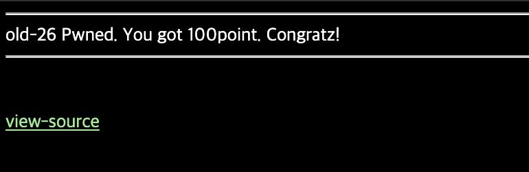

# 26

## 초기화면


소스코드를 바로 확인한다.

---
## 풀이
소스코드를 보면 php코드를 확인할 수 있다.
```php
<?php
  if(preg_match("/admin/",$_GET['id'])) { echo"no!"; exit(); }
  $_GET['id'] = urldecode($_GET['id']);
  if($_GET['id'] == "admin"){
    solve(26);
  }
?>
```
id값에 admin이 들어가면 no 메시지가 뜬다.

id값을 url디코딩 한 값이 admin이면 풀린다.
그래서 admin을 url인코딩한값 `%61%64%6d%69%6e`를 url에 넣어보면 url에서 바로 admin으로 변환하는지 no가 뜬다. 그래서 이중으로 인코딩 처리했다. 

`%2561%2564%256d%2569%256e`


---
## 통과



