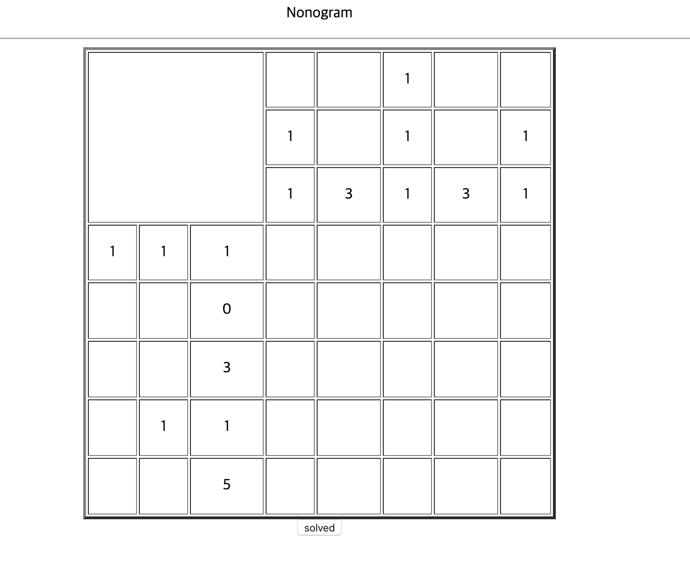
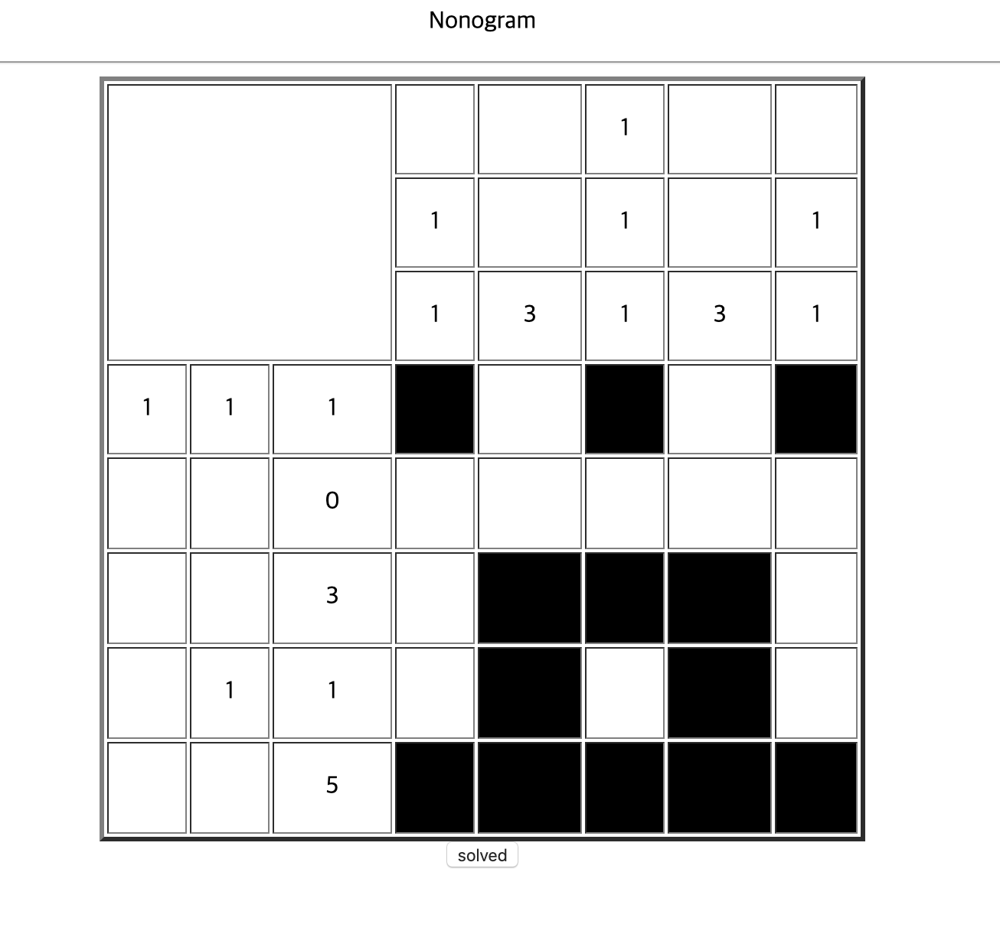
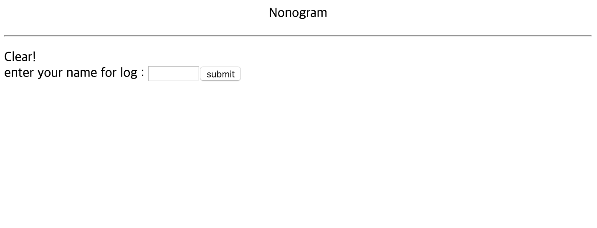
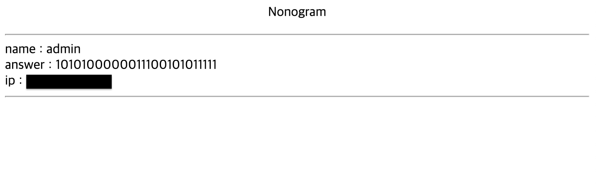
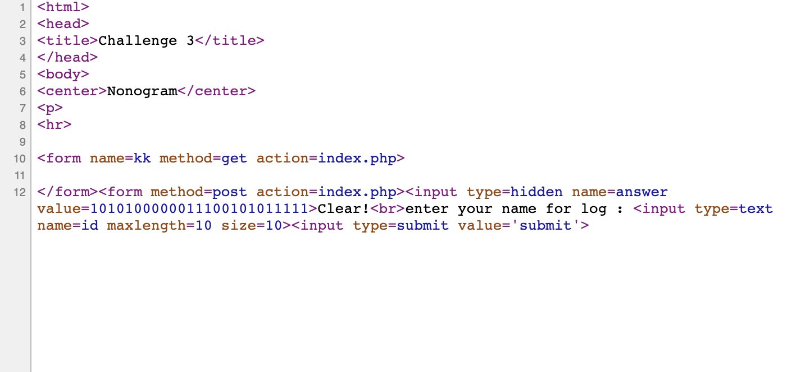
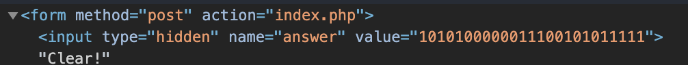
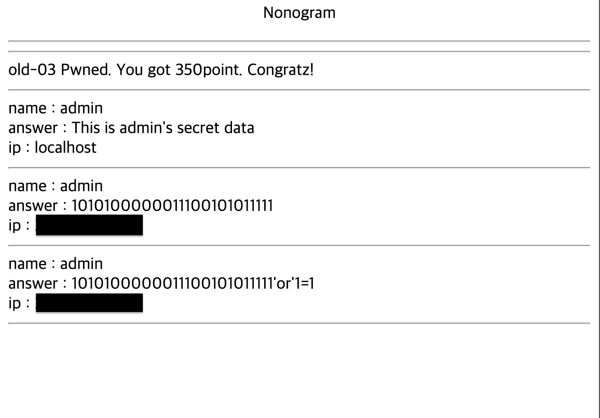

# 3

## 초기화면

퍼즐이 나온다.. 풀어본다

---
## 풀이

입력창이 나온다. 아무거나 입력해보면 입력한 값과 함께 새로운 페이지로 넘어간다.

answer값이 무엇일까?? 전 페이지의 소스코드를 살펴본다.

소스코드를 살펴보면 hidden이라는 입력태그가 있고 value가 아까의 수열이었다. 이 값을 참으로 바꿔서 넘겨보자!

`1010100000011100101011111or1=1` 의 결과는 No

`1010100000011100101011111||1=1` 의 결과도 No

싱글쿼터로 감싸서 시도해보면

`1010100000011100101011111'or'1=1` 의 결과는 성공

---
## 통과

