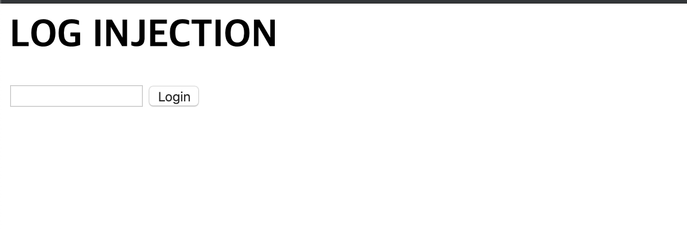
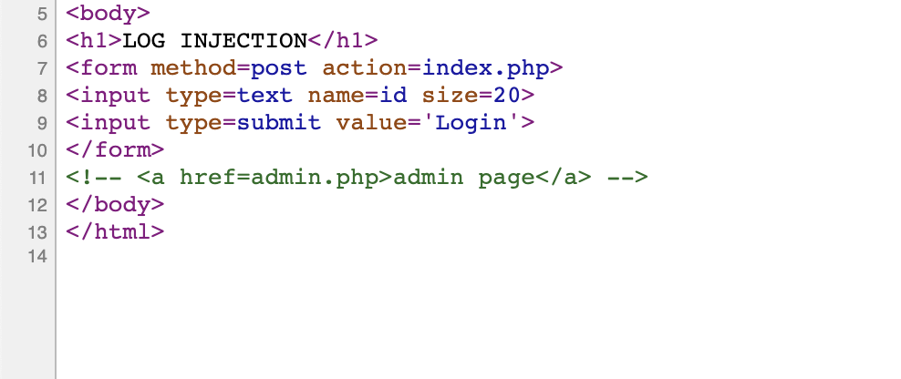
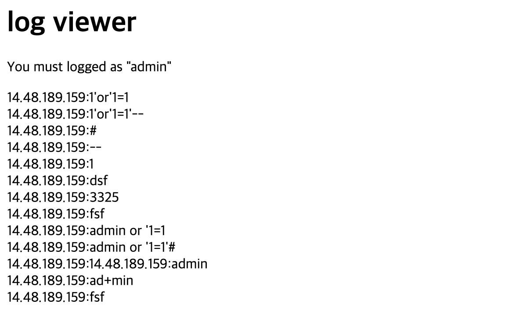
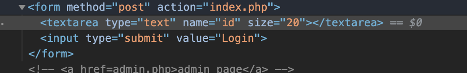
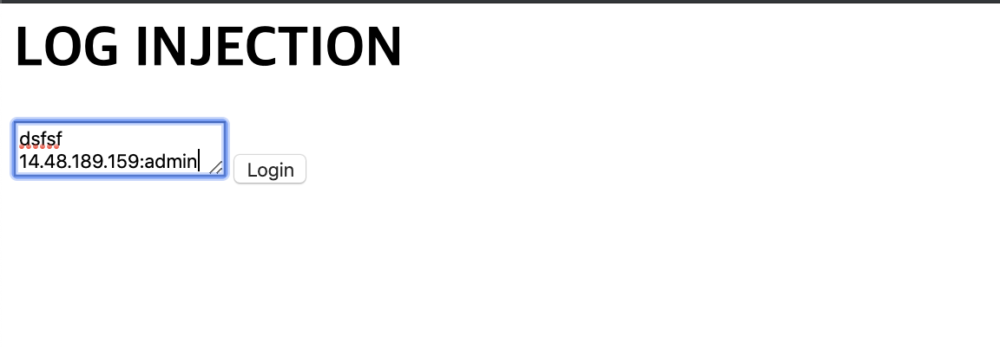
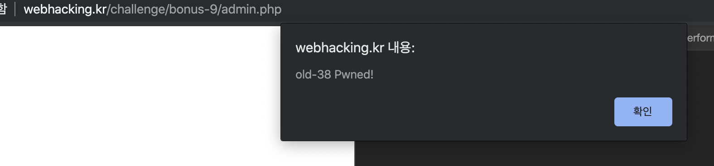
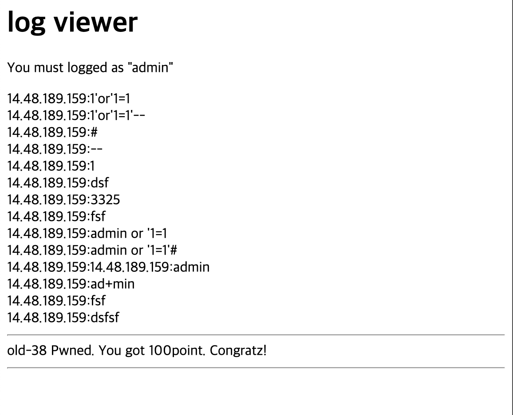

# 38

## 초기화면

log injection이라고 한다.

---
## 풀이
여러 문자를 입력해봐도 아무런 결과가 나타나지 않는다.

소스코드를 확인해보면 주석 코드를 볼 수 있다.
바로 이동을 해보면

지금까지의 로그 기록(삽질의 결과)이 누적 기록되어 있다. 

형식은 ip와 입력값이다. 삽질을 포기하고 구글링!!

># CR-LF Injection
>보통 CR-LF Injection이라고 하면 HTTP 패킷에 개행 문자를 넣어서 HTTP 응답값의 파라메터 변조를 하는 HTTP Response Split 같은데에 사용되는데, 여기서는 개행문자 끼워넣기 공격.
CR-LF는 리눅스에서 개행 문자, 즉 다음 줄로 바꾸는 줄바꿈 문자가 Carriage Return문자 + Line Feed 문자인데, 이를 줄여서 CR-LF라고합니다.
HTTP 패킷에서 파라메터들을 구분하는 문자열이기도 합니다.
>
>>출처: https://eine.tistory.com/entry/Rubiya-webhackingkr-old-38번-문제-풀이 [아인스트라세의 소프트웨어 블로그] 

개발자 도구에서 `<input>`을 `<textarea>`로 바꾸고

바뀐 창에 임의의 값과 개행,

그리고 아까 양식인 "ip주소:입력"대로 입력하면 아무런 변화가 없다.

admin.php로 이동을 하면

---
## 통과

