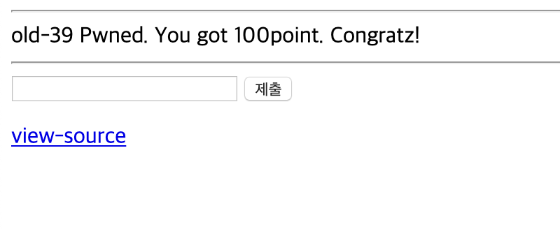

# 39

## 초기화면


---
## 풀이
아무 값이나 입력해도 변화가 없다.

소스코드를 보면 php코드를 확인할 수 있다.
```php
<?php
  $db = dbconnect();
  if($_POST['id']){
    $_POST['id'] = str_replace("\\","",$_POST['id']);
    $_POST['id'] = str_replace("'","''",$_POST['id']);
    $_POST['id'] = substr($_POST['id'],0,15);
    $result = mysqli_fetch_array(mysqli_query($db,"select 1 from member where length(id)<14 and id='{$_POST['id']}"));
    if($result[0] == 1){
      solve(39);
    }
  }
?>
```
코드를 찬찬히 보면 입력된 id값에서 \\는 그냥 사라져 버리고

싱글쿼터 하나는 2개로 치환된다. 최종적으로 id에는 처음부터 15째자리까지 잘려서 저장된다. 

sql쿼리를 보면 길이는 id는 14보다 작아야 한다. 그리고 id='로 시작해서 닫는 싱글쿼터가 없다. 따로 입력을 해줘야 할듯..

그럼 입력 창에 `admin_________'`(_는 space를 의미,공백9칸)를 입력한다. 그러면 마지막 싱글쿼터가 2개가 되지만 substr로 15를 잘라내니 상관없다.

---
## 통과



