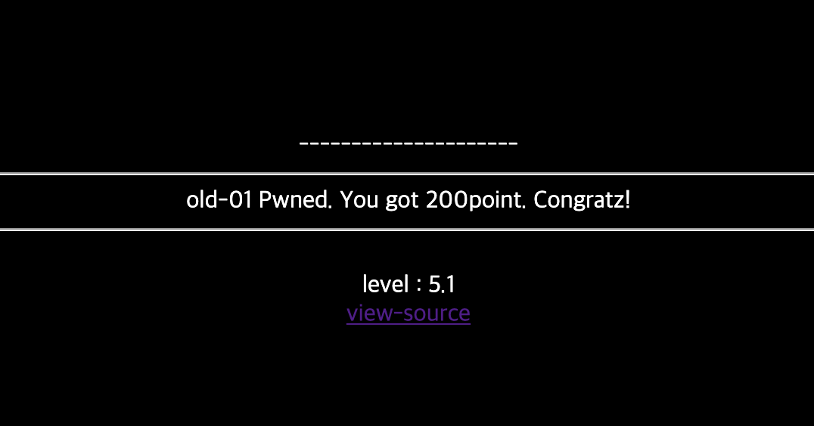

# 5

## 초기화면


---
## 풀이


```javascript
l='a';
ll='b';
lll='c';
llll='d';
lllll='e';
llllll='f';
lllllll='g';
llllllll='h';
lllllllll='i';
llllllllll='j';
lllllllllll='k';
llllllllllll='l';
lllllllllllll='m';
llllllllllllll='n';
lllllllllllllll='o';
llllllllllllllll='p';
lllllllllllllllll='q';
llllllllllllllllll='r';
lllllllllllllllllll='s';
llllllllllllllllllll='t';
lllllllllllllllllllll='u';
llllllllllllllllllllll='v';
lllllllllllllllllllllll='w';
llllllllllllllllllllllll='x';
lllllllllllllllllllllllll='y';
llllllllllllllllllllllllll='z';
I='1';
II='2';
III='3';
IIII='4';
IIIII='5';
IIIIII='6';
IIIIIII='7';
IIIIIIII='8';
IIIIIIIII='9';
IIIIIIIIII='0';
li='.';
ii='<';
iii='>';

lIllIllIllIllIllIllIllIllIllIl=lllllllllllllll+llllllllllll+llll+llllllllllllllllllllllllll+lllllllllllllll+lllllllllllll+ll+lllllllll+lllll; // oldzombie

lIIIIIIIIIIIIIIIIIIl=llll+lllllllllllllll+lll+lllllllllllllllllllll+lllllllllllll+lllll+llllllllllllll+llllllllllllllllllll+li+lll+lllllllllllllll+lllllllllllllll+lllllllllll+lllllllll+lllll; //document.cookie

if(eval(lIIIIIIIIIIIIIIIIIIl).indexOf(lIllIllIllIllIllIllIllIllIllIl)==-1) {
    alert('bye');
    throw "stop";
}if(eval(llll+lllllllllllllll+lll+lllllllllllllllllllll+lllllllllllll+lllll+llllllllllllll+llllllllllllllllllll+li+'U'+'R'+'L').indexOf(lllllllllllll+lllllllllllllll+llll+lllll+'='+I)==-1){
    alert('access_denied');
    throw "stop";
}else{
    document.write('<font size=2 color=white>Join</font><p>');
    document.write('.<p>.<p>.<p>.<p>.<p>');
    document.write('<form method=post action='+llllllllll+lllllllllllllll+lllllllll+llllllllllllll+li+llllllllllllllll+llllllll+llllllllllllllll+'>');document.write('<table border=1><tr><td><font color=gray>id</font></td><td><input type=text name='+lllllllll+llll+' maxlength=20></td></tr>');
    document.write('<tr><td><font color=gray>pass</font></td><td><input type=text name='+llllllllllllllll+lllllllllllllllllllllll+'></td></tr>');
    document.write('<tr align=center><td colspan=2><input type=submit></td></tr></form></table>');
}
```
차분하게 정리를 해보면 다음과 같은 코드이다. 
```javascript
if(eval("document.cookie").indexOf("oldzombie")==-1) {
    alert('bye');
    throw "stop";
}if(eval("document.URL").indexOf("mode=1")==-1){
    alert('access_denied');
    throw "stop";
}else{
    document.write('<font size=2 color=white>Join</font><p>');
    document.write('.<p>.<p>.<p>.<p>.<p>');
    document.write('<form method=post action=join.php>');document.write('<table border=1><tr><td><font color=gray>id</font></td><td><input type=text name=id maxlength=20></td></tr>');
    document.write('<tr><td><font color=gray>pass</font></td><td><input type=text name=pw></td></tr>');
    document.write('<tr align=center><td colspan=2><input type=submit></td></tr></form></table>');
}
```
위의 코드에 따라 조건문을 잘 우회해서 else 블럭을 출력해야 한다. 쿠키값과 url을 변조해보자!

---
## 통과



